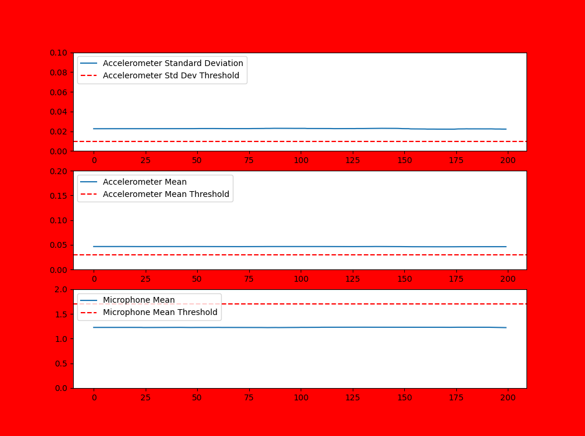

# Final Prototype Demonstration

Following prior testing as documented in `5_testing_results`, we had decided that our monitoring system would use a threshold-based system, whereby all three thresholds have to be met in order to signal that the concentrator is running. These three thresholds are related to:
- a 10 second rolling mean of the accelerometer magnitude
- a 10 second rolling standard deviation of the accelerometer magnitude
- a 10 second rolling mean of the microphone magnitude

In order to display the current status of the monitoring system in the figures below, the following colour coding is used:
- red signals that the concentrator is not running
- orange signals that the monitoring device is undergoing threshold calibration
- green signals that the concentrator is running

The below figures now run through an example test of the monitoring system. The x-axes show the last 200 readings (2 seconds) of each of the three measures discussed above. The y-axes for the accelerometer plots are measured in 'g'. For the microphone plot the y-axis is measured in 'volume  units', which is a scale from 0-10 of the range of noise that the microphone is capable of measuring.

Figure 1 shows a screenshot of the output when the device has just been turned on. The concentrator it is attached to is turned off, and there is only quiet background noise. The thresholds shown are presets based off typical concentrator characteristics, but they have not been calibrated to the particular concentrator. The screen is red showing that the device is recording the concentrator as being turned off.

**Figure 1:** Screenshot of prototype when the oxygen concentrator is turned off and there is no noise.

In Figure 2 the concentrator has now been turned on and it is clear that all three readings have risen in value. However, because the mean microphone output is below the required threshold, the screen is still red which incorrectly suggests that the concentrator is still off.

**Figure 2:** Screenshot of prototype when the oxygen concentrator is turned on, but the thresholds have not been calibrated.

In Figure 3 it shows an orange screen, which means the button has been pressed on the monitoring device, and threshold calibration is taking place. This calibration should be performed when the concentrator is turned on and only in the presence of quiet background noise. The calibration runs for 10 seconds and then adjusts the thresholds based off the incoming data that it has received.

**Figure 3:** Screenshot of prototype when the oxygen concentrator is turned on and the thresholds are being calibrated.

Figure 4 shows a screenshot of the output once calibration has been completed. The thresholds have been adjusted to match the specifications of the particular concentrator that it is monitoring. The screen has now turned green, which means the device is correctly monitoring the fact that the concentrator is on and running.

**Figure 4:** Screenshot of prototype when the oxygen concentrator is turned on and the thresholds have been correctly set.

Finally, Figure 5 shows an example of one of the worst-case scenario noise tests. The oxygen concentrator is turned off and has been left on uneven ground. As well as this, a second much more powerful concentrator has been turned on and left running directly next to the concentrator that the device is trying to monitor. Whilst the magnitude threshold has been met, both the noise and standard deviation measures have remained below the thresholds, and so the screen has remained red.

**Figure 5:** Screenshot of prototype when the oxygen concentrator is turned off and the thresholds have been correctly set, but the concentrator has been left on uneven ground and there is noise from another nearby concentrator.

Throughout all of the various tests that have been performed (as can be found in the `5_testing_results` folder), this threshold system proved to be robust against most sources of external noise that we were able to simulate in the Dyson Centre workshop.

It is important, however, that further tests are performed under the conditions that this device would actually be used, in order to see what level of precision and reliability it can achieve.

Further considerations for both the refinement and improvement of this prototype can be found in the `4_further_considerations` folder. 
