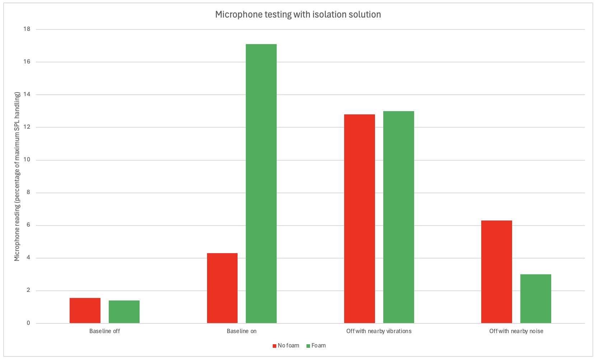

# Microphone Testing

In order to test the robustness of the microphone sensor we recorded the output over a range of different tests:
- measuring the output when the sensor is on a concentrator and the concentrator is running
- measuring the output when the sensor is on a concentrator and the concentrator is turned off
- measuring the output when the concentrator is turned off, but another concentrator is running 10cm away
- measuring the output when the concentrator is turned off but there is noise from talking, walking, knocks to the concentrator and random noise from the Dyson Centre workshop

Having performed the accelerometer testing, it was clear from the large magnitude of vibrations and high noise level from the black concentrator, that it would be the blue concentrator that was the limiting case. Hence, for the microphone testing, all of the tests were performed solely on the blue concentrator.

Figure 1 below shows each the four tests above run under two different conditions:
- the microphone attached to the concentrator with no external casing
- the microphone attached to the concentrator when surrounded by a cardboard box filled with sponge foam

The set-up and explanation of the sponge foam as noise isolation can be found in the `hardware_and_circuitry.md` file.

The y-axis on Figure 1 is measured as a percentage of the maximum reading that the microphone is capable of receiving. The size of the bars themselves represent the mean noise level over the duration of the 60 second tests.

**Figure 1:** Bar chart from the microphone testing performed on the blue concentrator.

It is clear from Figure 1 that without any surrounding casing to eliminate the effects of external noise, that the microphone would not provide a useful measure of whether or not the concentrator is running. However, by surrounding the sensor with foam (apart from on the side of the sensor that was in direct contact with the oxygen concentrator), the largest noise readings were then found for the case where the concentrator was running. Following this testing, it was then determined that the microphone would be incorporated into the final prototype.
