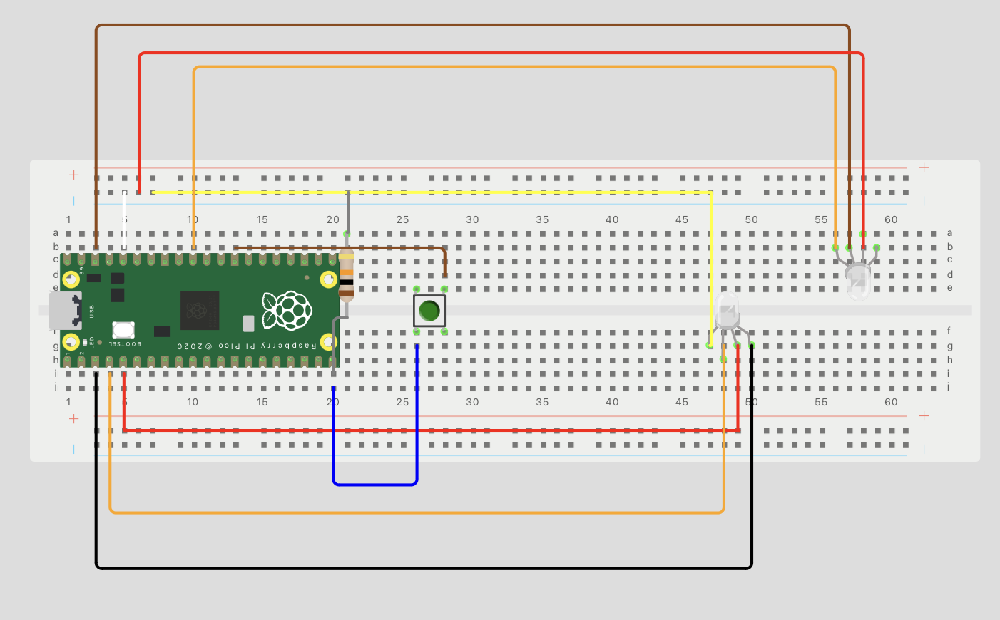

### Circuitry

# List of components

- Breadboard
- Rasberry pi pico wh
- ICM20948 9DoF Motion Sensor Breakout
- SparkFun Analog MEMS Microphone Breakout - SPH8878LR5H-1
- 10 kΩ resistor
- Jumper wires X 10
- 6mm button

### Mounting solution

### Sound isolation for microphone sensor
