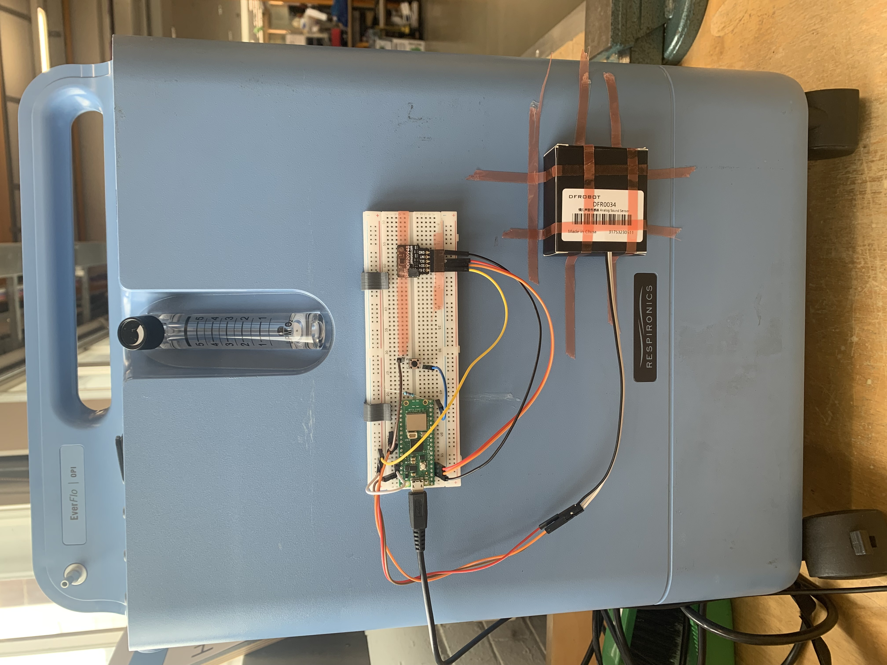

# Circuitry

Final prototype breadboard setup. 

### List of components

- Breadboard
- Raspberry Pi Pico WH
- ICM20948 9DoF Motion Sensor Breakout
- SparkFun Analog MEMS Microphone Breakout - SPH8878LR5H-1
- 10 kΩ resistor
- Jumper wires X 10
- 6mm button

### Connections

 - **2-5V** on accelerometer to **3V3(OUT)** on pico
 - **SDA** on accelerometer to **I2C1 SDA (GP2)** on pico
 - **SCL** on accelerometer to **I2C1 SCL (GP3)** on pico
 - **GND** on accelerometer to **GND** on pico

 - **VCC** on Microphone to **3V3(OUT)** on pico
 - **GND** on Microphone to **GND** on pico
 - **AUD** on Microphone to **I2C1 SDA (GP26)** on pico

 - **One leg** on Switch to **(GP15)** on pico
 - **Opposite leg** on Switch to **GND** on pico
 - Resistor connects **GP15** to **live rail** 

Where a pin number is specified in brackets it is required to be compatible with existing code but any GPIO pin will suffice.

For testing of each sensor separately as the same pin connections were used.

Raspberry Pi Pico WH datasheet:

https://datasheets.raspberrypi.com/picow/pico-w-datasheet.pdf , Accessed:(03/06/2024)

### Circuit setup schematic

The microphone is shown attached to the breadboard for the purpose of the schematic, but tests were run with is inside a separate casing but still wired to the pico. This is shown in later sections.

# Mounting solutions

### Breadboard attachment

In order to run tests reproducibly and be able to quickly mount and dismount the breadboard for alteration, we designed custom clips. These were 3D printed from PLA filament after SolidWorks modelling. The STL file for the [clip](/Final_output/Hardware_and_circuitry/Assets/clip.STL) is shown in the Assets folder. Two clips were used per concentrator, superglued to a flat surface of the plastic casing. See [further considerations](/Final_output/Further_considerations/) for how this can be improved.

### Sound isolation for microphone sensor

As seen in [testing](/Final_output/Testing/) initial microphone tests were not promising for differentiating between concentrator sound and background noise. In order to rectify this, a solution was required to isolate the concentrator noise and exclude external noise. 
To do this as a rapid prototype, the sensor was taped to the inside of a box with a hole facing the concentrator. The box was then filled with foam to exclude external noise. The setup is shown below with the box open for aid of visualisation:

The data for the success of this setup is shown in the testing section.

# Concentrator testing

### Concentrators used for testing

We were using two concentrators for testing: 

- Drive Devilbiss 10 Litre Compact Oxygen Concentrator 1025 
- Philips Respironics EverFlo 5L Oxygen Concentrator

They are both on the upper end of price, but the Philips concentrator well resembled the concentrators used in practice in term of its output(5L) and its noise level (43dB). The most common concentrators that we are designing for are in the 40-50dB range. The Devilbiss concentrator is reported at 69dB operational noise level. This made it a useful worst-case scenario for many of our interference tests, where we would monitor the quiet concentrator with the loud one running nearby. 

### Final Setup 

The micro usb is connected to a laptop which uses Thonny to code the Raspberry Pi Pico WH, and Python to read the accelerometer and microphone outputs through the serial port.

