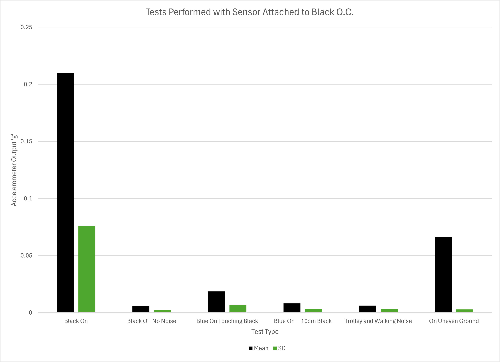
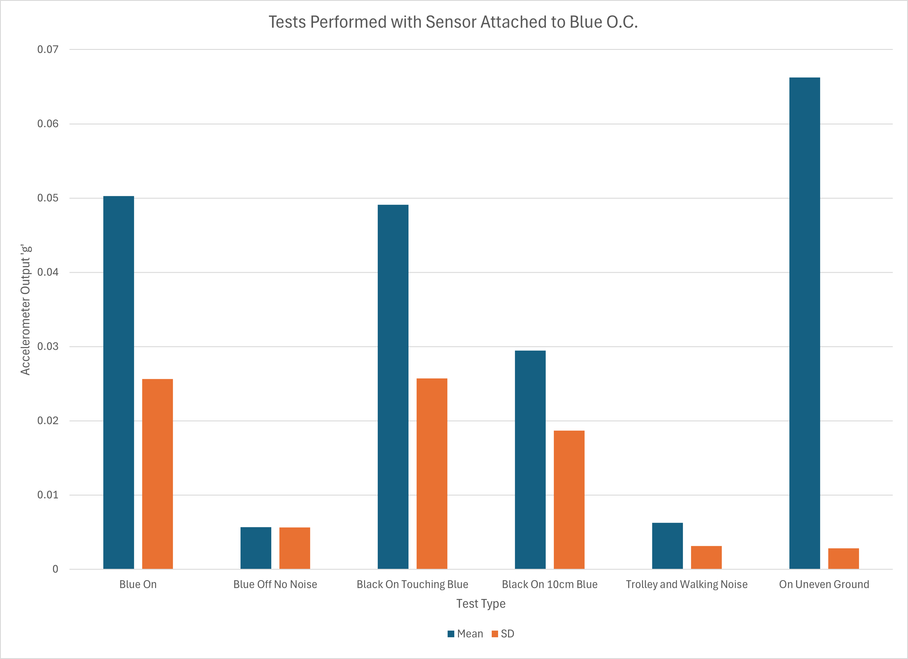
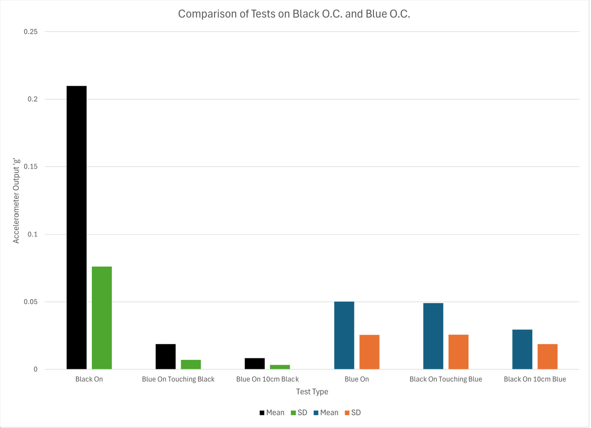

# Accelerometer Testing

In order to test the robustness of the accelerometer sensor we recorded the accelerometer output over a range of different tests:
- measuring the output when the sensor is on a concentrator and the concentrator is running.
- measuring the output when the sensor is on a concentrator and the concentrator is turned off.
- measuring the output when the concentrator is turned off but another concentrator is running and making direct contact.
- measuring the output when the concentrator is turned off but another concentrator is running 10cm away.
- measuring the output when the concentrator is turned off but there is external noise from walking, talking, rolling a trolley and other noises from the Dyson Centre workshop.
- measuring the output when the concentrator is turned off but it has been left on an uneven slope.

Each of these tests were performed firstly with the accelerometer on the black oxygen concentrator, and using the blue concentrator to make noise in the other tests. Then they were performed with the accelerometer on the blue concentrator and the black concentrator was used to make noise. The exact models of the two concentrators can be found in the `hardware_and_circuitry.md` file.

In order to present the results, a 1000 reading (i.e. roughly 10 seconds) rolling mean and standard deviation were recorded throughout the duration of the 120 second test. In order to assess how well these measures can determine whether or not the concentrator is turned on or off, the charts below show the smallest readings of mean and standard deviation that were recorded over the duration of the test for the 'concentrator on' case, and then the largest readings of mean and standard deviation for the other noisy test cases.

It is clear from Figure 1 that the magnitude of the vibrations of the black concentrator are large enough to make it very robust against other noise. In all cases the mean and standard deviation during the 'on' case were significantly larger than any of the other test cases, and as such it is simple for the sensor to use these measures to determine when the concentrator is on or off.

**Figure 1:** Bar chart from the testing performed on the black concentrator.

However, the Figure 2 below tells a different story. The blue EverFlo concentrator is significantly more quiet - 43dB rather than 69dB for the black one. The most common concentrators used in the target market are 40-50dB, so this is more indicative of the results we would expect to see during service. Here the results show that the mean and standard deviation for the noise test cases can be of a similar or greater magnitude than the baseline-on case. This makes detection more difficult. Having the powerful black concentrator turned on next to the blue concentrator gives readings of comparable value as when the blue concentrator is running, and so this could give false readings. Furthermore, uneven ground gives large readings for the magnitude, so any unexpected placement of the concentrator could give false readings. Also, the standard deviation for the concentrator off and no noise test was much larger than expected, and after further analysis this was due to just a few larger readings over the course of the test, which shows the ability of short knocks or impacts to the concentrator to spike the standard deviation reading.

**Figure 2:** Bar chart from the testing performed on the blue concentrator.  

Figure 4 shows the readings from the tests performed on the two oxygen concentrators placed next to each other for easy comparison. This shows that any strongly vibrating machinery placed nearby to the blue concentrator could result in false readings, whereas for the black concentrator it is much easier to differentiate the on and off state.

**Figure 3:** Bar chart comparing the data between the black and blue concentrator tests.