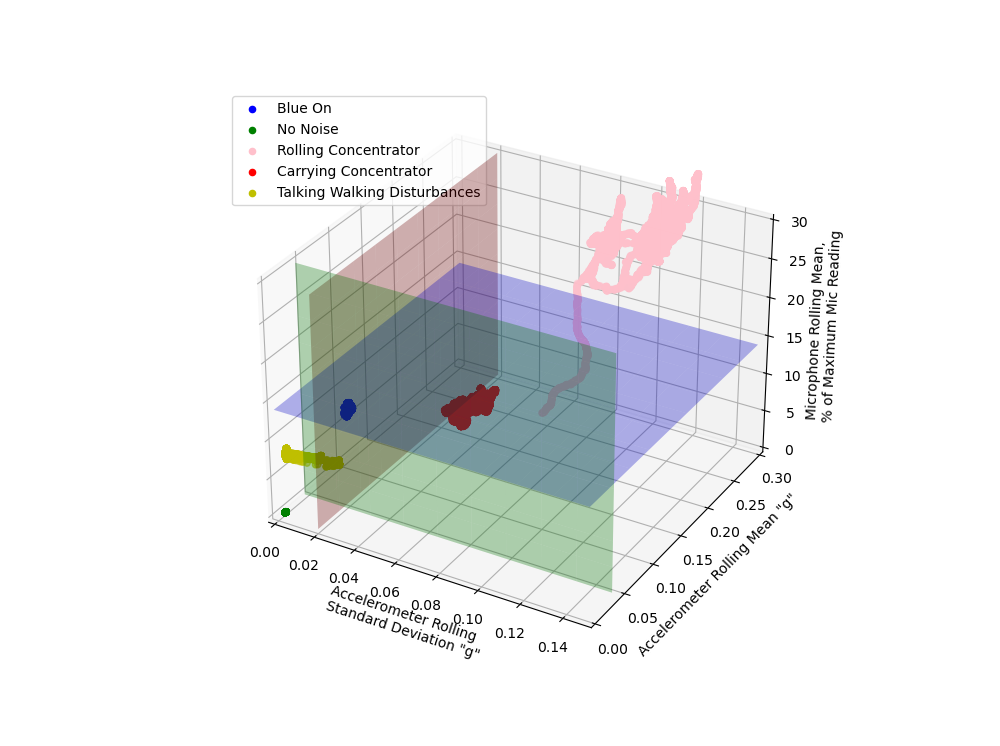

# Combined Sensor Testing

Once the testing of the individual sensors had been completed as shown in `accelerometer_tests.md` and `microphone_tests.md`, we combined the sensors to create one complete circuit as shown in `hardware_and_circuitry.md`.

We then performed further testing to see how we could use the sensors to determine whether or not the concentrator was running. The three pieces information that were being calculated were:
- The 10s rolling mean of the accelerometer magnitude
- The 10s rolling standard deviation of the accelerometer magnitude
- The 10s rolling mean of the microphone reading

The accelerometer magnitude was being measured in "g" and the microphone output was being measured as a % of the maximum value it was capable of reading.

We then performed the following tests:
- Concentrator on
- Concentrator off and no noise
- Concentrator off and being rolled around
- Concentrator off and being carried around
- Concentrator off and noise from walking, talking and other randon Dyson Centre workshop noise

The data from the tests that were run over a 60 second time period were plotted on a 3D scatter plot as shown in Figure 1 below.

**Figure 1:** 3D scatter plot showing the datapoints from the various test scenarios.

Figure 1 itself cannot be used to interpret the data as it shows a 3d space on a 2d screen. However it should help to understand the following discussion points from testing. If you want to be able to traverse the 3d space the data is included in the `test_data/combined_sensor_tests` folder and the code to run it is included in the `code/combined_sensors_code/3d_plot_past_data.py` file.

Once all of the data was plotted in the 3d space it was possible to investigate how the different sources of noise would occupy the space. It becamce quickly apparent that it was possible to separate all of the noise sources from the 'on' case by setting a threshold for each of the three axes, which all had to be met at the same time to show that the concentrator was running. These threshold have been plotted on the scatter plot as planes.

The only noise case that violated all of these thresholds at once was rolling the concentrator around on a rough floor. However, the impact that this has on the final readings is likely small, as the concentrators will likely be running for hours each day, and only being moved for a few minutes. Methods to investigate this effect and potentially eliminate it are discussed in the `further_considerations.md` document.

Excluding the effect of rolling the concentrator around, the threshold system was 100% accurate over the duration of all tests performed throughout this project. However, further testing over longer duraton timescales should be performed to verify this level of accuracy.