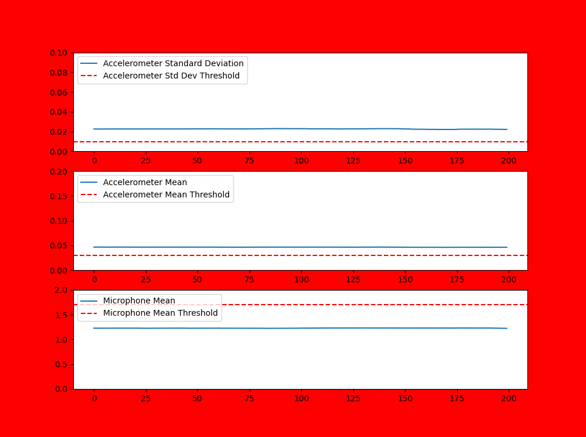
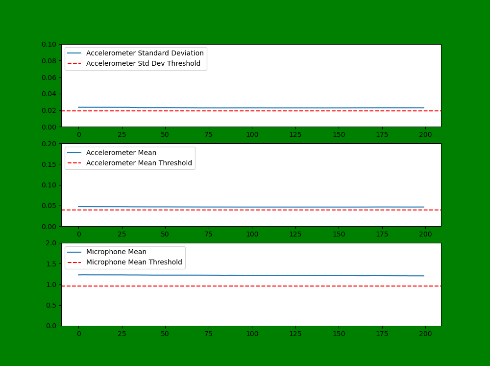
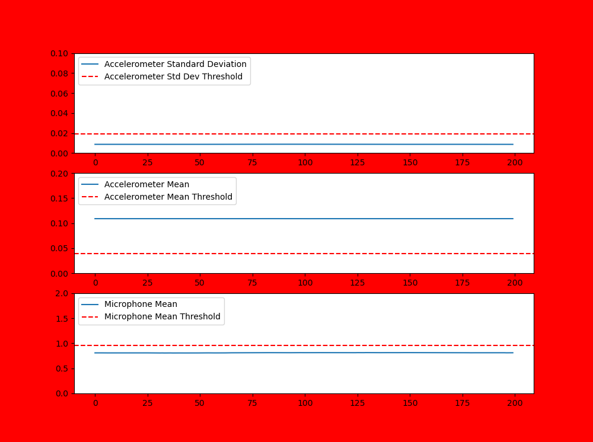

# Final Prototype Demonstration

Following prior testing, we had decided that our monitoring system would use a threshold based system whereby all three thresholds have to be met in order to signal that the concentrator is running. These three thresholds are related to:
- a 10 second rolling mean of the accelerometer magnitude
- a 10 second rolling standard deviation of the accelerometer magnitude
- a 10 second rolling mean of the microphone magnitude

In order to display the current status of the monitoring system in the figures below, the following colour coding is used:
- red signals that the concentrator is not running
- orange signals that the monitoring device is undergoing threshold calibration
- green signals that the concentrator is running

The below figures now run through an example test of the monitoring system.

**Figure 1:** Screenshot of prototype when the oxygen concentrator is turned off and there is no noise.

**Figure 2:** Screenshot of prototype when the oxygen concentrator is turned on but the thresholds have not been calibrated.

**Figure 3:** Screenshot of prototype when the oxygen concentrator is turned on and the thresholds are being calibrated.

**Figure 4:** Screenshot of prototype when the oxygen concentrator is turned on and the thresholds have been correctly set.

**Figure 5:** Screenshot of prototype when the oxygen concentrator is turned off and the thresholds have been correctly set, but the concentrator has been left on uneven ground and there is noise from another nearby concentrator.

