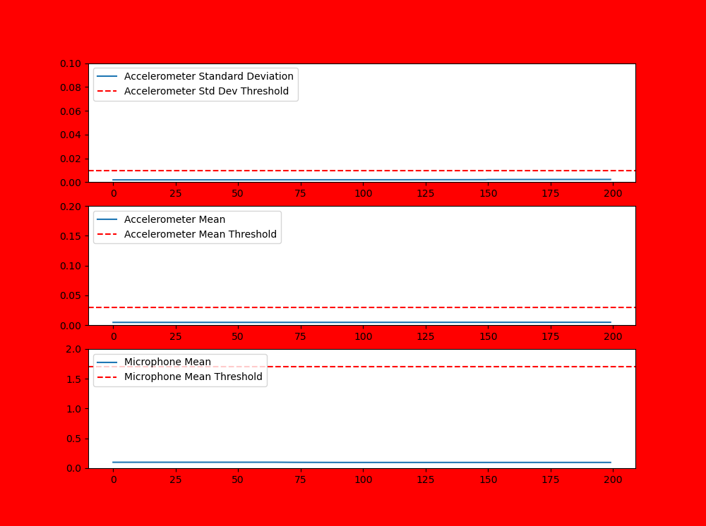
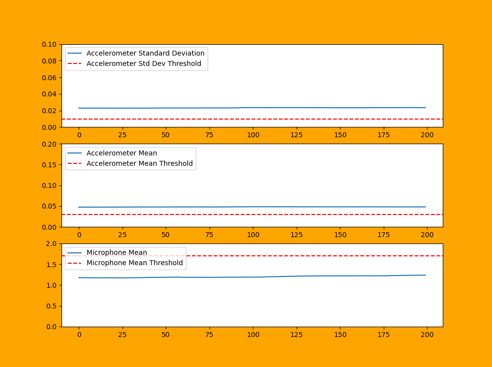

**Figure 1:** Screenshot of prototype when the oxygen concentrator is turned off and there is no noise.

**Figure 2:** Screenshot of prototype when the oxygen concentrator is turned on but the thresholds have not been calibrated.

**Figure 3:** Screenshot of prototype when the oxygen concentrator is turned on and the thresholds are being calibrated.

**Figure 4:** Screenshot of prototype when the oxygen concentrator is turned on and the thresholds have been correctly set.

**Figure 5:** Screenshot of prototype when the oxygen concentrator is turned off and the thresholds have been correctly set, but the concentrator has been left on uneven ground and there is noise from another nearby concentrator.

