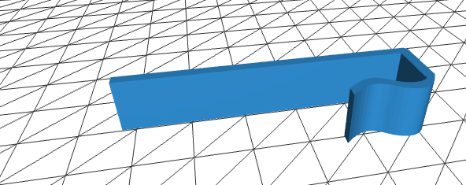
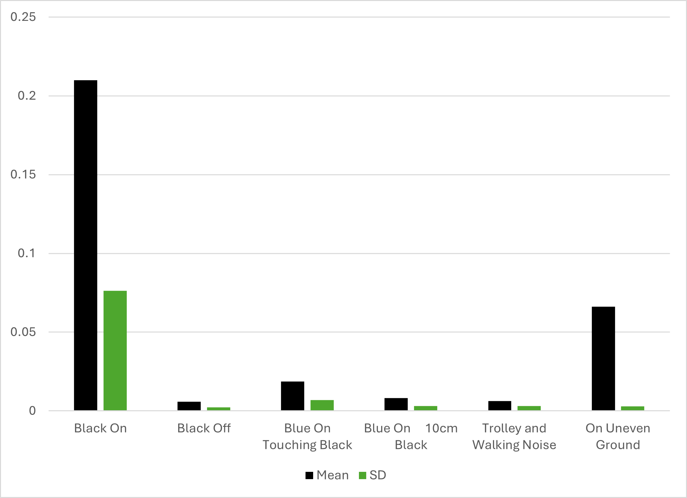
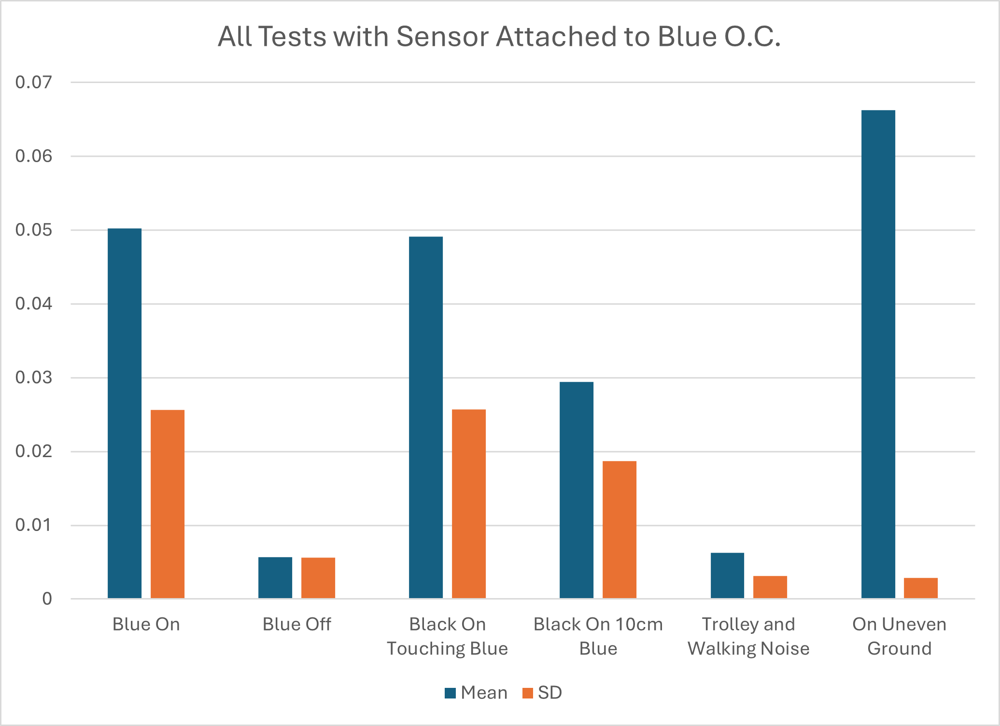
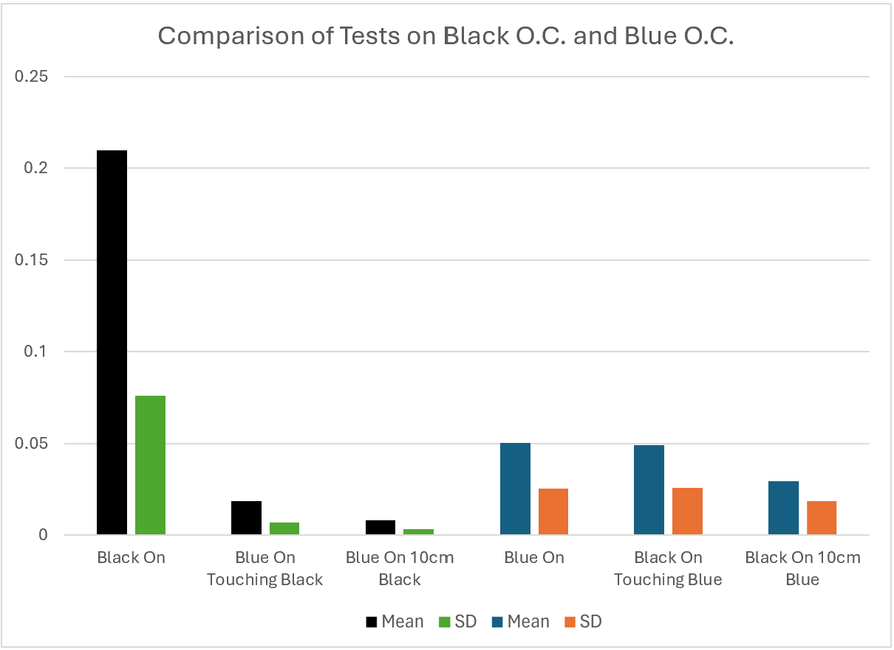
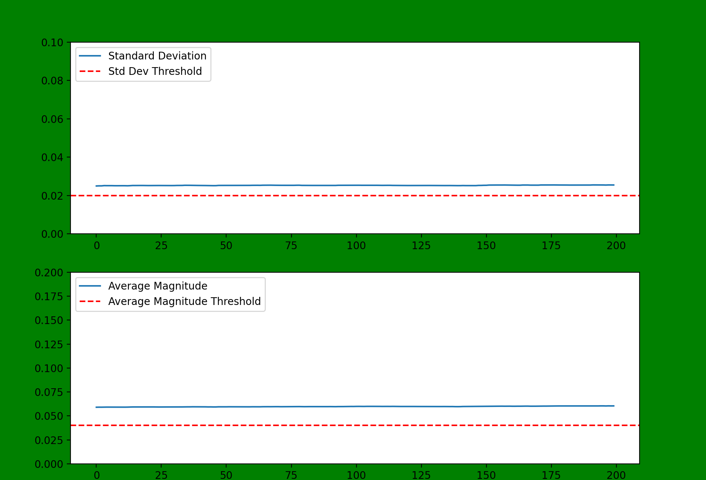
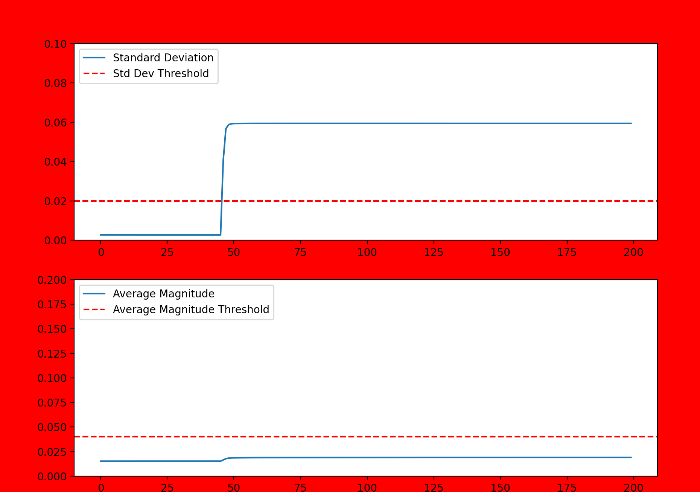
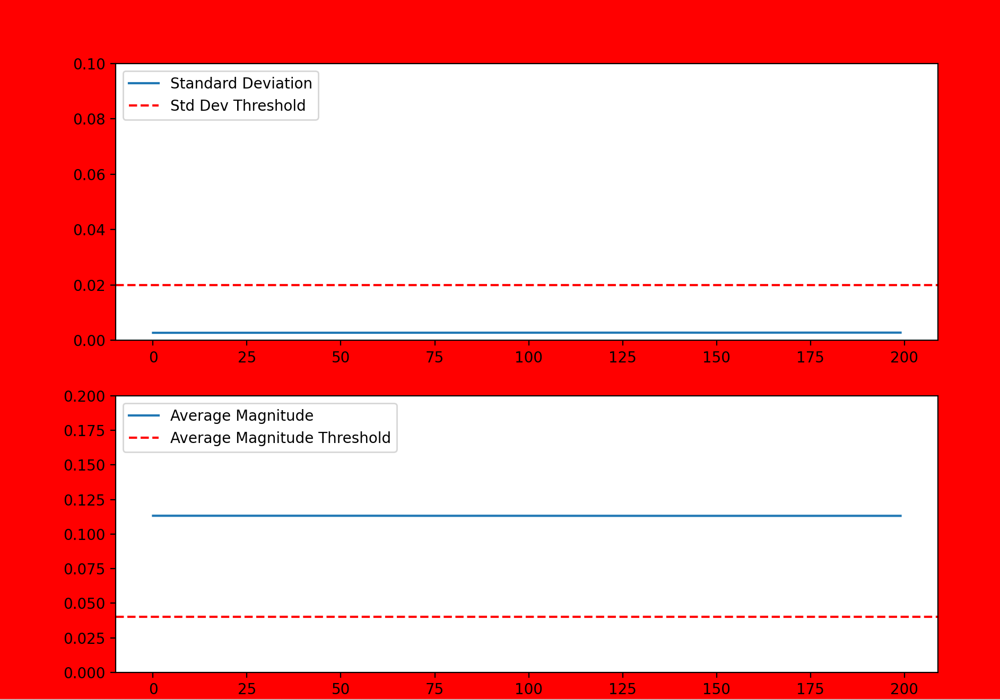
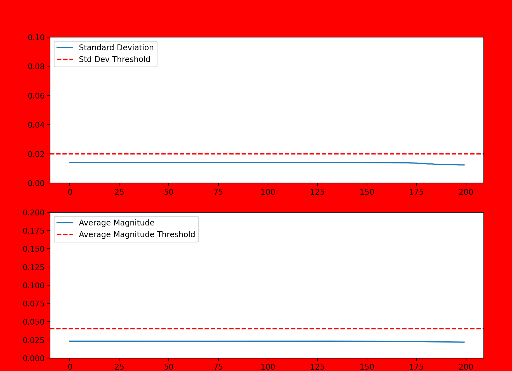
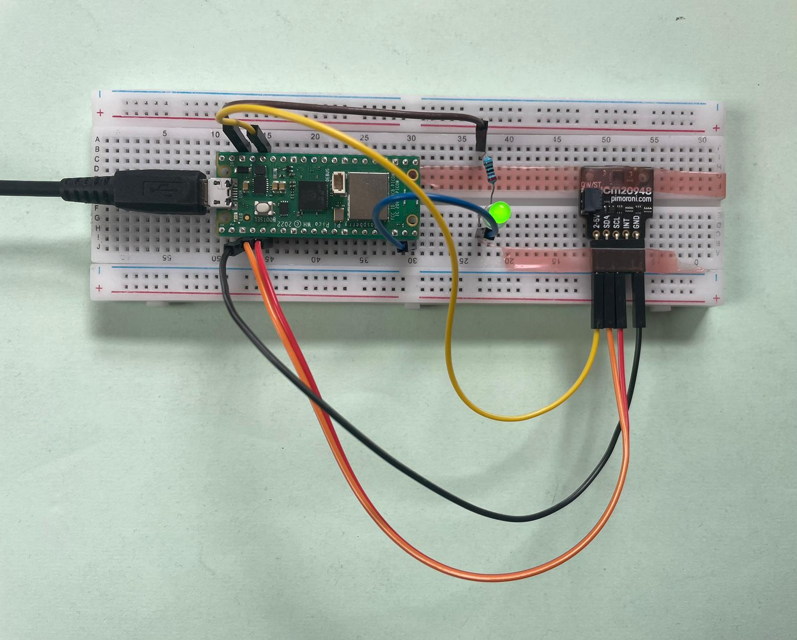

# Interim Presentation

### Work we have achieved to date

- Background reading on other similar applications of non-intrusive load monitoring. 
- Settled on our most promising idea for achieving monitoring using vibration sensing.
- Connected accelerometer to microcontroller.
- Written code to read and manipulate accelerometer data.
- Connected LED circuit to give visual interpretation of data.
- 3D printed mounting solution for breadboard. 
- Tested the vibration readings under a variety of conditions to help determine our measurement approach to monitoring.
- Data analysis of vibration readings.
- Developed and tested some prototype code using Matplotlib to determine and show whether or not the concentrator is on or off.

# Setup and Testing

### Setting up the accelerometer

To allow the Rasberry pi pico to read the accelerometer outputs, we first soldered pins onto the accelerometer so that we could connect it the the breadboard. We then attached the pico and accelerometer onto the breadboard and connected them together using jumper wires between the following pins:
 
 - **2-5V** on accelerometer to **3V3(OUT)** on pico.
 - **SDA** on accelerometer to **I2C1 SDA** on pico.
 - **SCL** on accelerometer to **I2C1 SCL** on pico.
 - **GND** on accelerometer to **GND** on pico.

Reading the output:

The next step was to be able to read the outputs from the accelerometer. This was done using an early version of the code main_interim_prototype.mpy and we were able to read the outputs using Thonny. It returned values of the x, y and z components of the acceleration as well as the magnitude.
In order to plot and visualise the accelerometer outputs we used python in VS Code to read the serial output and create a live plot using the Matplotlib animation function. An example of this plot can be seen in Figure 1 below.

**Figure 1:** Screenshot of the python script plotting the x, y, z components from the accelerometer as well as the magnitude (measured in 'g'). The scale at the bottom shows the last 200 readings (i.e. 2 seconds).

Next we attempted to remove the gravitational component of the reading on the accelerometer by using the inbuilt gyros. We tried various filters and algorithms but were unable to find a simple enough solution, and so to avoid wasting time we decided simply to assume the sensor always remains vertical, and remove a value of 1g from the z output.

### Performing testing

In order to test our accelerometer under the same conditions each time, it was important to create a system to mount the breadboard to the concentrator. Using a CAD design and 3D printing, we made clips that are glued to the plastic casing and allowed the breadboard to be attatched and removed easily. See clip.STL in the assests file.

We then ran tests to see if we could find a suitable vibration threshold that would indicate if the oxygen concentrator was being used. To do this we ran six different experiments, where we measured the vibrations:
- when the concentrator was turned on
- when the concentrator was turned off with no noise
- when the concentrator with the sensor attached was turned off, but the other concentrator was turned on and touching it
- when the concentrator with the sensor attached was turned off, but the other concentrator was turned on and 10cm away from it
- when the concentrator with the sensor attached was turned off, but we continuously rolled a trolley past and simulated heavy footfall
- when the concentrator with the sensor attached was turned off, but we put the front wheels on blocks to simulate being on uneven ground

Each test was run for 120 seconds. We then took the data and calculated the value of every rolling 10s mean and standard deviation. On the graphs we then plotted the smallest value of the rolling mean and standard deviation for the baseline-on test, and then the largest of the mean and standard deviation for the other test cases. 

Figure 2 below shows the results from when the accelerometer was attatched to the black (significantly louder) concentrator. This shows that both the mean magnitude of vibration and the standard deviation when the concentrator is on can be easily differentiated from the other cases. 

**Figure 2:** Bar chart from the testing performed on the black concentrator.  

However, the Figure 3 below tells a different story. The blue EverFlo concentrator is significantly more quiet - 43dB rather than 69dB for the black one. The most common concentrators used in the target market are 40-50dB, so this is more indicitve of the results we would expect to see during service. Here the results show that the mean and standard deviation for the test cases is of a similar or greater magnitude to the baseline-on case. This makes detection more difficult. Having the powerful black concentrator turned on next to the blue one gives comparable values to when the blue concentrator is in the on state and so could give false readings. Furthermore, uneven ground gives large readings for the magnitude, so any unexpected placement of the concentrator could give false readings. Also the standard devation for the baseline-off test was much larger than expected, and after further analysis this was due to just a few larger values, which shows the ability of short impacts to the concentrator to spike the standard deviation reading.

**Figure 3:** Bar chart from the testing performed on the blue concentrator.  

Figure 4 shows the relative readings from the tests performed on the two oxygen concentrators, this shows that any strongly vibrating machinery placed nearby to the blue concentrator could result in false readings, whereas for the black concentrator it is much easier to differentiate the on and off state. This is something we plan to test further in order to better understand the liklihood and severity of this case in practice.

**Figure 4:** Bar chart comparing the results from the black and blue concentrators.  

The charts above have clearly demonstrated that being on uneven ground can give large mean value readings but very low standard deviation, as it is a steady state error. A sudden impact on the concentrator is enough to push the standard deviation over the expected value but due to the 10 second moving average it does not casue a dramatic increase in the average magnitude. This resulted in the implementation of a double threshold system where both magnitude and standard deviation were required to be above their threshold value for the device to recognise the concentrator as on. Tests below show the success of this new system.

Using these results we initially attempted to code the double threshold system directly onto the Raspbery Pi Pico, using an integrated LED circuit. Whilst we managed to get it working for the mean threshold, when we added in the standard deviation data we had memory storage issues. For this reason the 'prototype' discussed in the nect section takes the accelerometer readings from the serial port and then does all the calculations and analysis in python on a laptop.

# Prototype

### How it works

- Our 'prototype' python code takes the readings of the magnitude of acceleration as measured by the accelerometer, and finds the mean and standard deviation of the last 1000 readings (i.e. 10 seconds).
- Every time a new reading comes in, the mean and standard deviation values are updated and then compared to a threshold. The thresholds have been determined from the testing done in the previous section. These thresholds determine whether or not the code thinks that the concentrator is currently turned on or off.
- In order to visualise this information, we have used the Matplotlib.animation function to plot the updated mean and standard deviation every time a new reading is taken. The plot shows the last 200 updated readings.
- The thresholds that are set for the mean and standard deviation are also plotted on the graph for easy viewing. When both thresholds are met the screen will turn green to show that the oxygen concentrator is running. If one or both of the outputs are below their respective thresholds then the screen will be red, indicating that the concentrator is not running. 

### Demonstration
All of the following data and graphics have been produced from testing performed with the accelerometer attached to the blue oxygen concentrator (the quieter of the two).
Figure 5 shows the Matplotlib output when the blue concentrator is turned on. Both the mean and standard deviation of the accelerometer readings are above the predetermined threshold and so the screen has turned green.

**Figure 5:** Protoype output when the blue concentrator is turned on.  

Figure 6 shows how the mean and standard deviation are affected by large knock to the concentrator. This noise is enough to send the standard deviation reading well over the threshold, but the mean stays comfortably below, and so the screen stays red.

**Figure 6:** Protoype output when the blue concentrator is turned off and knocked.  

Figure 7 shows the effect of leaving the concentrator on an uneven surface and during this measurement the concentrator was turned off. It is clear that the mean reading is well above the threshold due to gravity affecting the accelerometer readings. However, the standard deviation remains close to zero and so because this threshold is not met, the screen remains red.

**Figure 7:** Protoype output when the blue concentrator is turned off and left on an uneven surface.  

Figure 8 shows the Matplotlib interface when the blue concentrator is turned off, but the noisy black concentrator is turned on next to it and making direct contact. Whilst the readings are clearly above zero neither threshold is met and so the screen is red to show that the concentrator is not running.

**Figure 8:** Protoype output when the blue concentrator is turned off, and the black concentrator is turned on and touching. 

Below is a demonstation video of the above tests being performed.

https://github.com/Technology-for-the-Poorest-Billion/2024-OVSI/assets/98593139/cfc9f4a7-5daf-4990-bf7b-f4c7b06e2e5d

By using python to manipulate and plot the readings from the accelerometer it allowed for much easier analysis of how the monitoring system was working. However, once we had the above system in place, it was possible to try and convert the concept back into micropython code and use it alongside the LED circuit once again. This is now running successfully, and follows the exact same concept as the above prototype. Figure 9 below shows a photo of the setup, whereby the green LED lights up when both the mean and standard devation values are above the threshold.

**Figure 9:** Breadboard with Raspberry Pi Pico, accelerometer sensor and LED circuit.

### Issues and steps to overcome

- First microphone sensor gave poor data and so we reshuffled the schedule to focus on vibration monitoring until a new sensor was delivered 3 days later. 
- The inital Matplotlib.animation plot was severly lagging due to the fact that it was attempting to update the plot every time a new value was read. To overcome this we added in a buffer which stored the values to be plotted, and then seperately updated the plot at a more acheivable rate using the values stored in the buffer.
- The output was failing to include all of the incoming values from the serial port. This is because initally the reading of the data was being performed inside the loop which was operating more slowly than the speed of the incoming data. To overcome this we added a seperate thread which was able to add the serial output readings to the buffer in the background, whilst the main code could continue to manipulate the data and update the plots.
- We initally had problems performing the required calculations directly on the pico itself, which is why we resorted to doing it in python, so that we could continue with our testing without getting behind schedule. We eventually managed to get the LED code working on the pico again, and so we could transfer what we had done in python into micropython.
- As mentioned above we aimed to remove the gravitational component of the reading on the accelerometer by using the inbuilt gyros. We tried various filters and algorithms but were unable to find a simple enough solution, and so to avoid wasting time we decided simply to assume the sensor always remains vertical, and remove a value of 1g from the z output.
- During testing we found that uneven surfaces gave accelerometer magnitude readings that were above the threshold value. We also found that some unexpected noise during our baseline off test pushed the standard deviation much closer to the threshold level than we were expecting. Becasue of these two findings we settled on using a double threshold of mean and standard deviation to eliminate false readings. This then gave the correct monitoring status for all of the data that we recorded during testing.

### Personal and technical development

Harry: 

- Learned about the climate we are implementing our solution into. 
- Learned how to connect different sensors to a variety of microcontrollers and how to wire an LED circuit. Self taught from online manuals.
- Learned how to solder connections with help from a technician in the dyson centre.
- Learned how to use the 3D printer to make the clips. 

Alex:

- Reminder of how microcontrollers work using online resources and datasheets.
- Learnt how to programme a Raspberry Pi Pico using micropython and Thonny.
- Learnt how to read from the serial port using python.
- Learnt how to use Matplotlib.animation to produce live plots.
- This has all been self taught using various online sources.
- Improved my resilience to the constant issues that I faced during coding

### Updated project development timeline 

- Week 1: Understanding the problem and identifying potential solutions.
- Week 2: Setup of vibration monitoring prototype and successful testing. 
- Week 3: Sound monitoring feasability test, refinement of vibration prototype. 
- Week 4: Documenting our invisiged next steps for the development of the monitoring system. Submitting project deliverables.

Slight reshuffle due to a delay in sound sensor arriving but overall ahead of schedule.

### Plan for project completion 

- Initially looking to spend 2 days maximum testing the new microphone sensor. If early results seem promisng then we can continue with further testing, otherwise we will focus on further development of the accelerometer setup.
- Further analysis of test data for vibrations to set a more robust design threshold. Looking to perform further experiments such as testing on different floor surfaces and trying to find various realistic sources of random noise.
- Run longer duration tests to establish better accuracy.
- Decide if degredation monitoring is feasible in the remaining time.
- Create a document of next actions and key feedback for Ben, based off the project findings.