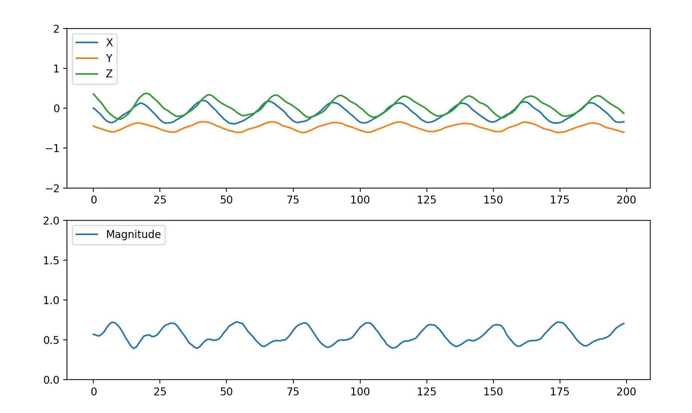

# Interim Presentation

### Work have we achieved to date

- Background reading on other similar applications of non-intrusive load monitoring. 
- Settled on our most promising idea for achieving monitoring using vibrations.
- Connected accelerometer to microcontroller.
- Written code to read and manipulate accelerometer data.
- Connected LED circuit to give visual interpretation of data.
- 3D printed mounting solution for breadboard. 
- Tested the vibration readings under a variety of conditions to help determine our measurement approach to monitoring.
- Data analysis of vibration readings.
- Developed and tested some prototype code using Matplotlib to determine and show whether or not the concentrator is on or off.

# Setup and Testing

### Setting up the accelerometer

**include here the setup of the breadboard circuit**

- The first step was to be able to read the outputs from the accelerometer. This was done using an early version of the code main_interim_prototype.mpy and we were able to read the outputs using Thonny. It returned values of the x, y and z components of the acceleration as well as the magnitude.
- In order to plot and visualise the accelerometer outputs we used python in VS Code to read the serial output and create a live plot using the Matplotlib animation function. An example of this plot can be seen in Figure 1 below.

**Figure 1:** Screenshot of the python script plotting the x, y, z components from the accelerometer as well as the magnitude (measured in 'g'). The scale at the bottom shows the last 200 readings (i.e. 2 seconds).
- Next we aimed to remove the gravitational component of the reading on the accelerometer by using the inbuilt gyros. We tried various filters and algorithms but were unable to find a simple enough solution, and so to avoid wasting time we decided simply to assume the sensor always remains vertical, and remove a value of 1g from the z output.

**include here any info about the 3d printed clips and how we attached the breadboard**

**INCLUDE HERE A DESCRIPTION OF THE BELOW TESTS SO THAT THE CHARTS MAKE SENSE**

**Figure 2:** Bar chart from the testing performed on the black concentrator.  

**Figure 3:** Bar chart from the testing performed on the blue concentrator.  

**Figure 4:** Bar chart comparing the results from the black and blue concentrators.  

# Prototype

### How it works

- Our 'prototype' python code takes the readings of the magnitude of acceleration as measured by the accelerometer, and finds the mean and standard deviation of the last 1000 readings (i.e. 10 seconds).
- Every time a new reading comes in, the mean and standard deviation values are updated and then compared to a threshold. The thresholds have been determined from the testing done in the previous section. These thresholds determine whether or not the code thinks that the concentrator is currently turned on or off.
- In order to visualise this information, we have used the Matplotlib animation function to plot the updated mean and standard deviation every time a new reading is taken. The plot shows the last 200 updated readings.
- The thresholds that are set for the mean and standard deviation are also plotted on the graph for easy viewing. When both thresholds are met the screen will turn green to show that the oxygen concentrator is running. If one or both of the outputs are below their respective thresholds then the screen will be red, indicating that the concentrator is not running. 

### Demonstration
All of the following data and graphics have been produced from testing performed with the accelerometer attached to the blue oxygen concentrator (the quieter of the two).
Figure 5 shows the Matplotlib output when the blue concentrator is turned on. Both the mean and standard deviation of the accelerometer readings are above the predetermined threshold and so the screen has turned green.

**Figure 5:** Protoype output when the blue concentrator is turned on.  

Figure 6 shows how the mean and standard deviation are affected by large knock to the concentrator. This noise is enough to send the standard deviation reading well over the threshold, but the mean stays comfortably below, and so the screen stays red.

**Figure 6:** Protoype output when the blue concentrator is turned off and knocked.  

Figure 7 shows the effect of leaving the concentrator on an uneven surface and during this measurement the concentrator was turned off. It is clear that the mean reading is well above the threshold due to gravity affecting the accelerometer readings. However, the standard deviation remains close to zero and so because this threshold is not met, the screen remains red.

**Figure 7:** Protoype output when the blue concentrator is turned off and left on an uneven surface.  

Figure 8 shows the Matplotlib interface when the blue concentrator is turned off, but the noisy black concentrator is turned on next to it and making direct contact. Whilst the readings are clearly above zero neither threshold is met and so the screen is red to show that the concentrator is not running.

**Figure 8:** Protoype output when the blue concentrator is turned off, and the black concentrator is turned on and touching.  
Below is a demonstation video of the above tests being performed.

https://github.com/Technology-for-the-Poorest-Billion/2024-OVSI/assets/98593139/cfc9f4a7-5daf-4990-bf7b-f4c7b06e2e5d

### Issues and steps to overcome

- First microphone sensor gave poor data and so we reshuffled the schedule to focus on vibration monitoring until a new sensor was delivered 3 days later. 
- [Alex write about code issues and how they were resolved]
- Need a more powerful microcontroller
- During testing we found that uneven surfaces gave accelerometer magnitude readings in similar range to when it is in operation. We also found that we got a large spike in our baseline off test that pushed the standard deviation close to the operational level. Becasue of these two things we settled on using a double threshold of magnitude and standard deviation to eliminate false readings. 

### Personal and technical development

Harry: 

- Learned about the climate we are implementing our solution into. 
- Learned how to connect different sensors to a variety of microcontrollers and how to wire an LED circuit. Self taught from online manuals.
- Learned how to solder connections with help from a technician in the dyson centre.
- Learned how to use the 3D printer to make the clips. 

Alex:

- Learnt how to code a Raspberry Pi Pico using micropython and Thonny.
- Learnt how to read from the serial port using python.
- Learnt how to use Matplotlib.animate to produce live plots

### Updated project development timeline 

- Week 1: Understanding the problem and identifying potential solutions.
- Week 2: Setup of vibration monitoring prototype and successful testing. 
- Week 3: Sound monitoring feasability test, refinement of vibration prototype. 
- Week 4: Documenting our invisiged next steps for the company. Project deliverables.

Slight reshuffle due to a delay in sound sensor arriving but overall ahead of schedule.

### Plan for project completion 

- 2 days max testing microphone as it will likely be highly innacurate but worth ruling out with concrete testing. 
- Further analysis of test data for vibrations to set design threshold. INCLUDE EXAMPLES SUCH AS TESTING ON DIFFERENT SURFACES AND FINDING DIFFERENT VIBRATION SOURCES...
- Run longer timeframe test to establish accuracy.
- Decide if degredation monitoring is feasible. Create a document of next actions and key feedback for Ben.
