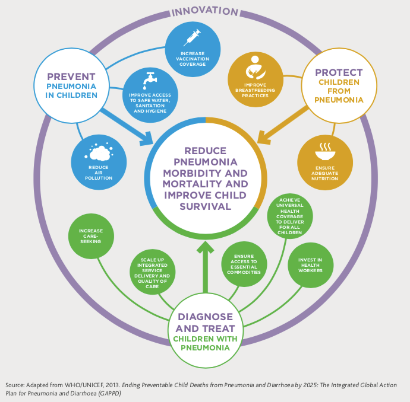

# Problem description

"Pneumonia kills more children than any other infectious disease, claiming the lives of over 700,000 children under five every year... almost all of these deaths are preventable" - UNICEF [2024]. It has been shown that in countries with robust oxygen systems, hospital-based pneumonia deaths can be reduced by half. However, due to the harsh operating environment in Sub-Saharan Africa and South East Asia where pneumonia is most prevalent, these oxygen concentrators often fail to operate reliably.

The graphic above shows that there are three main 'pillars' that can help to reduce pneumonia related deaths in children: prevention, protection and treatment. As mentioned previously and shown in the graphic, one of the main ways that the treatment of children with pneumonia can be improved is by ensuring that everyone has access to essential commodities - such as oxygen. However, one of the main challenges for Ministries of Health is having the ability to collect meaningful data about the usage and operational status of their oxygen concentrators. If they were armed with this data it would help them to identify the needs and gaps of oxygen supplies in their country, and be able to deal with repair and maintenance more efficiently.

A study by Bradley et al. [2015] on oxygen concentrator maintenance in The Gambia estimates that with the correct preventive maintainance the useful lifespan of these concentrators in low-resource settings could exceed 7 years. The preventive maintenance (PM) checks often resulted in minor repairs having to be carried out, which were generally low-cost and required a low level of experience to complete. This demonstrates that if the usage of a fleet of oxygen concentrators could be accurately measured and recorded, that it could help to schedule PM checks at the optimal times in the lifespan of each concentrator. The study noted that "forty-one per cent of faults needing repair were discovered during PM checks, which likely mitigate more serious or costly future breakdowns and lengthy equipment outages".

It is clear therefore that a simple, low-cost and reliable device that could be implemented to measure the usage of any commercially available oxygen concentrator would be a huge benefit to both biomedical engineers and the Ministries of Health. It would allow for better management and allocation of oxygen concentrators throughout a region, to ensure that all concentrators are being used to maximal effect. By helping to better schedule PM it could also reduce the downtime of the oxygen concentrators and help to catch issues before they escalate into major and costly failures.

# Presentation of the proposal

This project aims to design a reliable and non-invasive monitoring device that is capable of recording the operational status of an oxygen concentrator and that is suitable for use in low-resource settings. 

### The main aims of the project will be to:

- Test various sensors and evaluate their effectiveness given the context that the device will be used in, in order to determine the best choice for the given requirements. The sensor will be used to determine whether or not the concentrator is currently running.  
- Perform degradation testing, to see if any of the sensors would be suitable to try and predict whether any maintenance/repairs will be necessary in the near future.  
- Think about how the monitoring device will attach onto the oxygen concentrators. There are multiple different brands of concentrators all with slightly varying designs, and the device should be made to be compatible with all versions without the need for alterations.  

### Additional aims if time allows:

- Look at how the data from the monitoring device would be stored and collected by the hospital workers.  
- Think about how the device could be used to show that an oxygen concentrator is currently in need of repair, so that data on the number of currently broken concentrators can also be collected.
- Investigate the existing infrastructure in the countries that this device is being designed for and then research a suitable method for collecting and transferring the data to the relevant people.

### Initial scope:

From a brainstorm of potential usage monitoring methods we arrived at the following overarching methods:

- Vibrations --> accelerometer fixed to outer casing will detect usage. It also has the potential to detect changes in frequencies, which could indicate faults.

- Power outlet --> current and/or voltage monitoring to detect usage data, however cannot be invasive i.e. become part of the medical device. 

- Noise --> oxygen concentrators operate above 40dB which is comparable to a quiet refrigerator and so interference in a busy hospital could be an issue. However it has the potential to be the cheapest sensor and could give a wide range of information about faults as well as identifying fault alarms from the concentrator, something the vibration sensor would be incapable of.

- Magnetic field --> the motor for the compressor will result in a magnetic field, however this is more likely to involve an invasive solution to measure the magnetic field and an ideal solution does not require the machine to be tampered with.

- Nitrogen output sensor --> flow would indicate the concentrator is in use and then partial pressure of nitrogen at the outlet would indicate how pure the oxygen is and hence give more detailed insight to the machine health. 

The most feasible sensor choices for this project appear to be vibration and noise with the resources available. We will source a microcontroller that is able to interpret data from either an accelerometer or a microphone to determine whether the machine is operational or not. Based on these results we will choose the best suited approach to the problem given the operating environment. We will proceed with further testing and development to give more insightful feedback and decide how to fix the device to the concentrator considering the optimal position for functionality and practical use.

# Assessment of the quality of the proposal

The Oxygen and Ventilator System Initiative (OVSI) "wants to ensure every individual has reliable and equitable access to essential medical oxygen". One of their key innovation domains is in developing a remote monitoring system that can integrate with all types of existing concentrators to track usage and schedule PM. Our proposal fits in well with this key aim, as it looks at doing early stage testing relating to the various different sensors that could be used and seeking out the potential of these sensors to detect any degradation of an oxygen concentrator. The output from this mini-project should help to give preliminary results and insights into the viablility of the different routes that could be taken to develop a non-invasive monitoring device.

### Key inclusive innovation principles/characteristics:

**Standards and Regulations** - The device should be non-invasive in nature so that it easily meets the strict European standards and regulations that surround the use of medical devices.  
**Collaboratively co-created** - The design process should involve all the stakeholders - particularly the end-users - to ensure that the device is both culturally and contextually appropriate.  
**Enhance agency** - The device should give better control to biomedical technicians and Ministries of Health over the effective use of oxygen concentrators and ensure that they will be able to manage and maintain the technology independently.  
**Low cost** - The design process must consider the initial cost (capex), the operating cost (opex), but also the potential monetary savings from the introduction of a simple and efficient monitoring system.  
**Context appropriate** - The device should be robust, reliable and easy to repair with consideration to the specific environmental conditions it will face.  
**Existing ecosystems** - The device must be designed in such a way that all of its functionality, from the way that it is powered to the way that it stores and transfers data, is able to fit in with the existing infrastructure.  

## References
UNICEF, [2024]. *Pneumonia in Children Statistics - UNICEF DATA*. Available at: https://data.unicef.org/topic/child-health/pneumonia/#:~:text=Pneumonia%20kills%20more%20children%20than,of%20these%20deaths%20are%20preventable.

Bradley B., Chow S., Nyassi E., Cheng Y., Peel D. and Howie S.R.C., [2015]. *A retrospective analysis of oxygen concentrator maintenance needs and costs in a low-resource setting: experience from The Gambia*. Health and technology, 4(4), pp.319–328.

‌