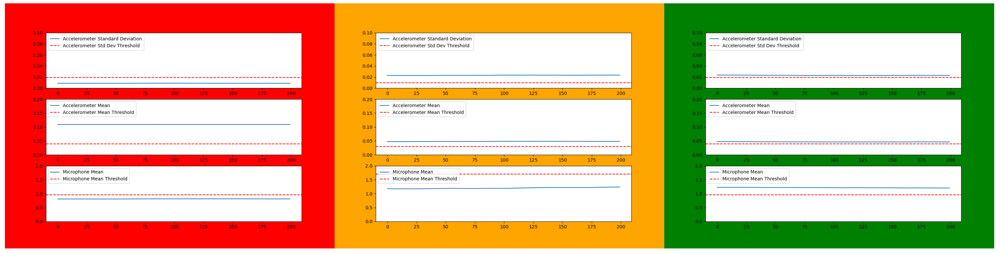
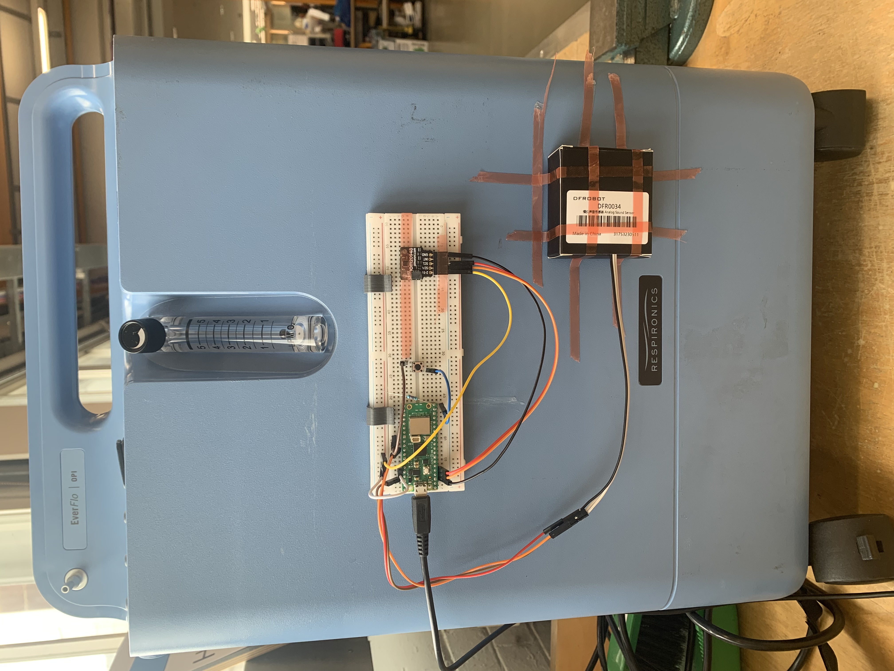

Our project addresses a critical healthcare challenge: ensuring reliable access to medical oxygen in low-resource settings to treat pneumonia in children. For this reason, we developed a prototype device which can be used to monitor the operational status of oxygen concentrators, which are essential medical resources for treating pneumonia, but often fail due to harsh operating conditions.

Our monitoring system uses sensors to track whether an oxygen concentrator is running. We tested various sensors and decided on a combination of an accelerometer and a microphone. These sensors measure the level of vibrations and noise, respectively. The prototype device uses a threshold-based system, where three conditions must be simultaneously met for the concentrator to be confirmed as running, which are all determined based off the information that the sensors are returning to the device.

#### **Robust Against Noise**

We demonstrated the resilience of our prototype to several test-cases:

- In all of the tests that were performed, when the concentrator was on and running, the device was able to correctly display this status 100% of the time.
- Of the eight simulations performed to test the monitoring device under different operating conditions, it proved to be robust against external noise in all but one case. With further testing and refinement of the model, as well as incorporating smart machine learning algorithms, it is hoped that the device will eventually be resilient to all types of interference.

#### **Universally Compatible**
- The device has in-built calibration capabilities, so that the thresholds can be set to ensure that the device is compatible with any brand of oxygen concentrator.
- With the press of one button, it then only takes ten seconds to ensure the device is optimally set up to work with the required oxygen concentrator.

#### **Clear Visual Cues**

The device's status is displayed using a simple colour-coded system:

Red: The concentrator is off.  
Orange: The device is in calibration mode.  
Green: The concentrator is on and running.

#### **The Prototype**

Below is an image of the prototype during testing, attached to a typical oxygen concentrator. The final device will contain all of the sensors and components in a simple yet effective housing, which will protect them from the harsh environmental conditions.

