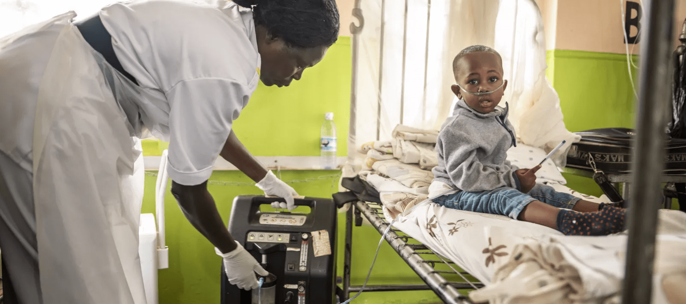

#### **The Problem**

"Pneumonia kills more children than any other infectious disease, claiming the lives of over 700,000 children under five every year... almost all of these deaths are preventable" - UNICEF [2024]. It has been shown that in countries with robust oxygen systems, hospital-based pneumonia deaths can be reduced by half. However, due to the harsh operating environment in Sub-Saharan Africa and South East Asia where pneumonia is most prevalent, these oxygen concentrators often fail to operate reliably.

#### **Our Partner OVSI**

The Oxygen and Ventilator System Initiative (OVSI) "wants to ensure every individual has reliable and equitable access to essential medical oxygen". One of their key innovation domains is in developing a remote monitoring system that can integrate with all types of existing concentrators to track usage and schedule predictive maintenance. 

#### **How We Fit In**

Our aim was to assess the feasability of a non intrusive monitoring device for oxygen concentrators. This involves experimenting with different sensors such as microphones and accelerometers to provide useful insight for OVSI on the most promising approaches to collecting usage data on oxygen concentrators. See [Our Prototype](about.md) page for more information.

